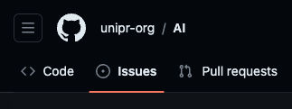
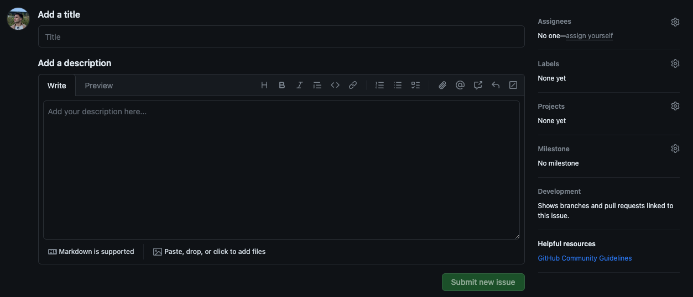
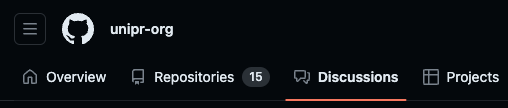
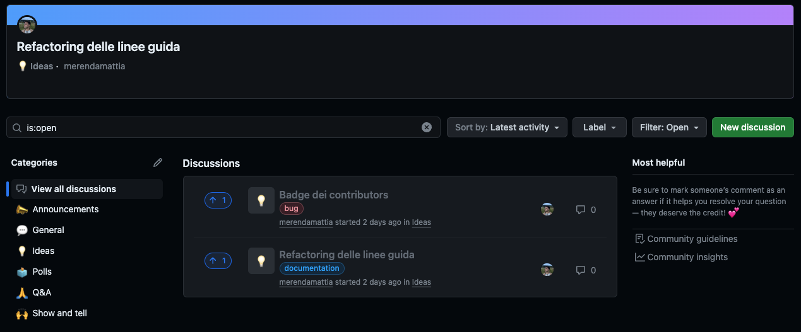
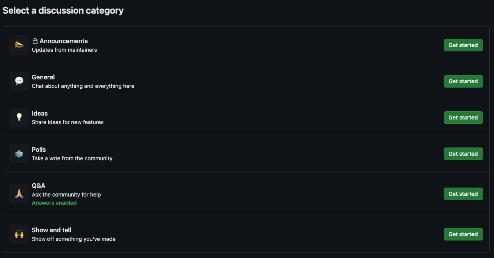

# Contatti

* Table of Content
{:toc}

## Creare un Issue
1. Andare nella repository interessata e spostarsi nella sezione *Issues*.
 

2. Creare un nuovo issue cliccando sul tasto verde *New Issue*. 
3. Ora possiamo descrivere il problema che abbiamo inserendo titolo e descrizione. Possiamo anche aggiungere un *Label* e/o assegnare l'issue a qualcuno tramite l'opzione *Assignees*.
 

## Avviare una Discussione
1. Andare nella sezione dedicata sulla [homepage dell'organizzazione](https://github.com/orgs/unipr-org/discussions).
 

2. In questa schermata è possibile vedere tutte le discussioni attive. È possibile partecipare e/o crearne una nuova cliccando il tasto verde *New discussion*.
 

3. Creando una nuova discussione, è possibile selezionare la categoria di quest'ultima.
 

## Contattare un moderatore
È possibile conttatare anche in privato un moderatore tramite la pagina *[teams](https://github.com/orgs/unipr-org/teams/mods)*. 