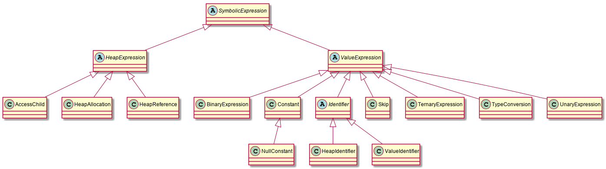
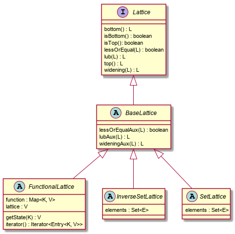
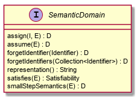

# The Analysis Infrastructure

LiSA's analysis infrastructure is split into four segments:

1. [Statement][stmt] semantics, taking care of defining the effect of a statement on the analysis state in an analysis-independent fashion;
2. [Call graph][callgraph] abstraction, resolving cfg calls and evaluating their abstract result;
3. [Heap][heap] abstraction, modeling the heap structure of the program;
4. [Value][value] abstraction, abstracting the values of program variables.

Moreover, LiSA has an internal hierarchy of [SymbolicExpression][symbolic]s targeted by abstract domains, and statements need rewrite themselves as symbolic expressions.

## On Symbolic Expressions

Symbolic expressions are the internal language of LiSA: all abstract domains reason in terms of these expressions. These expressions are defined, as can be seen in the image below, over an extremely small set of operations.



Statments defined in the program must rewrite themselves as symbolic expressions to model the side-effect free expression that is being built on the stack, that will eventually be fed to abstract domains to determine its effects. Possible expressions do not include CFG calls (as they are abstracted by the `CallGraph` instance used in the analysis). 

Symbolic expressions are split into two sub-hierarchies:
* Value expressions, that are expressions that work on constant values and identifiers;
* Heap expressions, that model heap operations.

As will be explained below, value abstractions can only reason about value expressions: all heap operations will be rewritten by heap abstractions before feeding the heap-free expression to the value abstraction. The rewriting happens in such a way that memory locations identified by combinations of heap expressions are mapped to a `HeapIdentifier`, agreeing to the logic of the heap abstraction used in the analysis.

## Analysis fundamentals

The overall analysis structure revolves around two basic structures: [Lattice][lattice] and [SemanticDomain][semdom]. These provide the base skeleton of all analysis objects.

### The Lattice interface

Classes implementing the `Lattice` interface represent elements of a lattice. For this reason, the interface defines methods representing lattice operations:



`Lattice` is a *generic* interface that is parametric to the concrete instance `L` of its implementing class, to have appropriate methods return types.

**Note 1:** `isBottom()` and `isTop()` are the methods used in LiSA to determine if a lattice instance represent the bottom or the top element, respectively. Default implementations of this method are provided, and these use reference equality against `bottom()` and `top()`, respectively:

```java
public default boolean isBottom() {
	return this == bottom();
}
	
public default boolean isTop() {
	return this == top();
}
```

For the above to work, the returned values of `top()` and `bottom()` *have* to be unique (that is, no `return new ...` should appear in the methods). If that is not the case, override these methods providing a coherent logic.

**Note 2:** Lattice operations follow common patterns that are not dependent on the specific instance (like testing for top or bottom values). LiSA provides the `BaseLattice` class, that overrides lattice operations, handling these base cases. This class defines abstract auxiliary methods (like `lubAux()`) that subclasses can use to provide their implementation-specific logic, knowing that neither lattice instances are top (according to `isTop()`), bottom (according to `isBottom()`), or `null`, and that the two instances are not equal (according to both `==` and `equals()`). Unless explicitly needed, all concrete `Lattice` implementations should inherit from `BaseLattice`.

Three special instances of `Lattice` are provided within LiSA:
1. `FunctionalLattice`, that applies functional lifting to inner `Lattice` instances that are mapped to the same key (this type is parametric to `F`,`K` and `V`, that are the concrete type of `FunctionalLattice`, the type of the keys, and the type of the values - that must be a subtype of `Lattice` - respectively);
2. `SetLattice`, that models a lattice where elements are sets, and where the least upper bound is the set union (this type is parametric to `S` and `E`, that are the concrete type of `SetLattice` and the type of elements contained in the set, respectively);
3. `InverseSetLattice`, that models a lattice where elements are sets, and where the least upper bound is the set intersection (this type is parametric to `S` and `E`, that are the concrete type of `SetLattice` and the type of elements contained in the set, respectively);


### The SemanticDomain interface

Classes implementing the `SemanticDomain` interface represents entities that know how to reason about semantics of statements. `SemanticDomain` is parametric to the type `D` that is the concrete type of `SemanticDomain`, the type `E` of `SymbolicExpression`s that the domain can handle (e.g., a domain might be able to only reason about `ValueExpression`s), and the type `I` of `Identifier`s that the domain is able to reason on. The interface defines methods representing state transformations:



* `D assign(I identifier, E expression)` yields a copy of a domain modified by the assignment of the abstract value corresponding to the evaluation of `expression` to `identifier`;
* `D assume(E expression)` yields a copy of a domain modified by assuming that `expression` holds;
* `D forgetIdentifier(I identifier)` forgets all information about a `identifier` (e.g. when it falls out of scope);
* `D forgetIdentifiers(Collection<I> identifiers)` forgets all information about all `identifiers`;
* `String representation()` yields a textual representation of the domain;
* `Satisfiability satisfies(E expression)` yields whether or not `expression` is satisfied in the program state represented by a domain (`Satisfiability` is similar to a Boolean lattice, having values of `bottom`, `unknown`, `satisfied` and `not_satisfied` and methods to combine different satisfiability levels);
* `D smallStepSemantics(E expression)` yields a copy of a domain modified by the evaluation of the semantics of `expression`.

## The Abstract State

The Abstract State of LiSA's analysis is structured as defined in *Pietro Ferrara, A generic framework for heap and value analyses of object-oriented programming languages, Theoretical Computer Science, Volume 631, 2016, Pages 43-72* ([DOI](https://doi.org/10.1016/j.tcs.2016.04.001)). In this framework, the abstract state is composed of a heap abstraction ([HeapDomain][heap]) and a value abstrction ([ValueDomain][value]), where the semantics of expressions is first evaluated on the heap abstraction, that rewrites the expression by removing all the bits regarding heap operations with symbolic identifiers (`HeapIdentifier`s in LiSA). The rewrtitten expression is then processed by the value abstraction.

`HeapDomain` is an interface parametric on the concrete type `H` of the domain, and extends `Lattice<H>` and `SemanticDomain<H, SymbolicExpression, Identifier`, meaning that it can work on all `SymbolicExpression`s and can assign values to all types of `Identifier`s. It also extends the [HeapSemanticOperation][heapsemop] interface, meaning that il will provide rewritten expressions through method `getRewrittenExpressions()` (the returned collection usually contain a single expression, since expression rewriting is deterministc - more than one expression could be introduced through lattice operations, like least upper bound), and a substitution thorugh method `getSubstitution()`, yielding a list of materializations and summarizations of heap identifiers.

`ValueDomain` is an interface parametric on the concrete type `V` of the domain, and extends `Lattice<V>` and `SemanticDomain<V, ValueExpression, Identifier`, meaning that it can work on all `ValueExpression`s and can assign values to all types of `Identifier`s. A value abstraction must also react to the substitution provided by the heap abstraction: this is achieved through `applySubstitution()`, that comes with a default implementation.

LiSA's [AbstractState][absstate] is parametric on the type `H` of `HeapDomain` and the type `V` of `ValueDomain`, and implements `Lattice<AbstractState<H, V>>` and `SemanticDomain<AbstractState<H, V>, SymbolicExpression, Identifier>`. Semantic operations are implemented by invoking the corresponding operation on the heap domain, applying the yielded substitution to the value domain, and then invoking the operation on the value domain using the rewrtitten expressions produced by the heap domain.

### On non-relational analyses

Non-relational analyses compute independent values for different program variables, and are able to evaluate an expression to an abstract values by knowing the abstract values of program variables. The infrastructure for mapping variables to abstract values is abstracted away in LiSA through the concept of *environment* ([HeapEnvironment][heapenv] for heap analyses and [ValueEnvironment][valueenv] for value analyses), that is a `FunctionalLattice` mapping `Identifier`s to instances of [NonRelationalDomain][nonrel] (specifically, to [NonRelationalHeapDomain][nonrelheap] and [NonRelationalValueDomain][nonrelvalue] respectively). Environments are also instances of `SemanticDomain` (specifically, `HeapEnvironment` is a `HeapDomain` and `ValueEnvironment` is a `ValueDomain`).

`NonRelationalHeapDomain` (and `NonRelationalValueDomain`) is parametric to the type `T` of its concrete implementation, and is a special instance of `Lattice<T>` that, given a `HeapEnvironment<T>` (or `ValueEnvironment<T>` for its value counterpart), know how to evaluate a symbolic expression (with method `eval()`) and to check if an expression is satisfied (with method `satisfies()`).

## The Analysis State

The abstract state needs to be extended with some extra information about the program state at the executed statement, to model properties like the expression that is available on the stack for later computation. This extension is provided by the [AnalysisState][analysisstate], that contains an `AbstractState` and a collection of `SymbolicExpression`s that are available at a given moment in the program execution. This collection usually contains a single expression, that is the result of the abstract execution of the statement, but more than one expression could be introduced through lattice operations, like least upper bound. `AnalysisState` is parametric on the type `H` of `HeapDomain` and the type `V` of `ValueDomain`, and implements `Lattice<AnalysisState<H, V>>` and `SemanticDomain<AnalysisState<H, V>, SymbolicExpression, Identifier>`. Semantic operations are implemented by invoking the corresponding operation on the abstract state, and the computed expression is the assigned `Identifier` if the instance has been produced by a call to `assign()`, or that has been evaluated in case of `smallStepSemantics()`.

### On analysis modularity

`AnalysisState` is the "root" of the analysis object hierarchy, meaning that all external entities participating in the analysis or querying its results (e.g., fixpoint algorithms, `CallGraph` instances, ...) will interact exclusively with instances of this class, in an analysis-independent fashion: there is no compile-time binding between these entities and the concrete instances of `HeapDomain` and `ValueDomain` that will be executed, thus all operations that are be performed by such entities have to be agnostic of the actual abstract domains in place. This ensures a high level of modularity: all internal analysis components can be changed or replaced without requiring any modification of external ones.

## The CallGraph interface

All the analysis components introduced above only operate on `SymbolicExpression`s, that are able to model operations on both the heap and the concrete values, but no calling expression exists. To model calling instructions and achieve interprocedurality, LiSA uses [CallGraph][callgraph]s, that are able to resolve calls and evaluate their abstract result.

The `CallGraph` interface primarely defines two methods: 
* `Call resolve(UnresolvedCall call)` that, as stated while [introducing](cfg.md#about-regular-calls) `UnresolvedCall`s, can exploit type information to find their possible target(s);
* `AnalysisState<H, V> getAbstractResultOf(CFGCall call, AnalysisState<H, V> entryState, Collection<SymbolicExpression>[] parameters)` that can evaluate the abstract result of a `CFGCall` knowing its entry state and the `SymbolicExpression`s representing its parameters.

While it is ensured that one `CallGraph` will be available during the analysis, having it defined as an interface is another big factor to achieve analysis modularity: code that exploits `CallGraph`'s functionalities is agnostic to the actual implementation that will be used at analysis time, thus the the selection of the implementation to use at runtime is completely transparent to the analysis execution.

## Statement semantics

Having all the bits to compose and execute a complete analysis abstracted away from the statements semantics enables a clear and elegant definition of what they compute. This is achieved primarely in the `semantics()` method of the [Statement][stmt] class, that given an entry state (`AnalysisState`) and a `CallGraph` for resolve interprocedural operations, computes an exit state (`AnalysisState`). Implementations are also responsible of invoking inner expression's `semantics()` and store their result in the `expressions` parameter, that is a `FunctionalLattice` instance that maps [Expression][expr]s to their exit state for the fixpoint computation.

Defining what a statement computes is easy and straightforward. For instance, the semantics of the [Assignment][assign] statement is the following:
```java
public final <H extends HeapDomain<H>, V extends ValueDomain<V>> AnalysisState<H, V> semantics(
		AnalysisState<H, V> entryState, CallGraph callGraph, ExpressionStore<AnalysisState<H, V>> expressions)
		throws SemanticException {
	AnalysisState<H, V> right = getRight().semantics(entryState, callGraph, expressions);
	AnalysisState<H, V> left = getLeft().semantics(right, callGraph, expressions);
	expressions.put(getRight(), right);
	expressions.put(getLeft(), left);

	AnalysisState<H, V> result = null;
	for (SymbolicExpression expr1 : left.getComputedExpressions())
		for (SymbolicExpression expr2 : right.getComputedExpressions()) {
			AnalysisState<H, V> tmp = left.assign((Identifier) expr1, expr2);
			if (result == null)
				result = tmp;
			else
				result = result.lub(tmp);
		}

	if (!getRight().getMetaVariables().isEmpty())
		result = result.forgetIdentifiers(getRight().getMetaVariables());
	if (!getLeft().getMetaVariables().isEmpty())
		result = result.forgetIdentifiers(getLeft().getMetaVariables());
	return result;
}
```
The first four lines evaluate the semantics of the inner expressions and store their results in the `expressions` functional lattice. Then, the result is composed by assigning all possible expressions computed by the right hand-side to all the identifiers computed by the left hand-side. In the end, all meta-variables (that are syntetic identifiers used to represent temporary values on the stack, like calls' return values) are forgotten.

### Semantics of native calls

The common semantics of all call statements is defined in the [Call][call] class. In particular, subclasses of such class only have to define the `callSemantics()` method, that will be invoked *after* all the parameters' semantics have already been computed. This simplifies what [NativeCall][nativecall] implementations, that are by far the most widespread statement isntance in LiSA's CFG structure, need to compute. Moreover, [UnaryNativeCall][unnativecall]s and [BinaryNativeCall][binnativecall]s, that are `NativeCall`s with one and two parameters respectively, already define this method, taking care of performing the least upper bound between all possible expressions of each parameter (i.e., there is no need of defining `for` loops as in the semantics of the assignment). Subclasses of these types only have to provide a `unarySemantics()` and a `binarySemantics()`, respectively, operating on a single `SymbolicExpression` for each parameter.

## Executing an analysis

Registering an analysis for execution in LiSA is trivial:
* the instance of `CallGraph` to use during the analysis can be set by passing it to `lisa.setCallGraph(callGraph)`;
* an instance of `HeapDomain` can be registered for execution by passing it to `lisa.addHeapDomain(domain)`;
* an instance of `ValueDomain` can be registered for execution by passing it to `lisa.addValueDomain(domain)`;
* an instance of `NonRelationalHeapDomain` can be registered for execution by passing it to `lisa.addNonRelationalHeapDomain(domain)` - this will be automatically wrapped in an instance of `HeapEnvironment`;
* an instance of `NonRelationalValueDomain` can be registered for execution by passing it to `lisa.addNonRelationalValueDomain(domain)` - this will be automatically wrapped in an instance of `HeapEnvironment`;
* optionally, the results of the analysis on each CFG can be dumped in [GraphViz](https://www.graphviz.org/)'s `dot` format by invoking `lisa.setDumpAnalysis(true)`.

After registering all the desired domains, invoking `lisa.run()` will use `CallGraph`'s `fixpoint()` method to perform fixpoint computation on all CFGs, according to that `CallGraph`'s logic.

**Note 1:** If no `CallGraph` is set for the analysis, or if no instances of `HeapDomain` and `NonRelationalHeapDomain` are registered, default implementations will be used. Current default implementation for `CallGraph` is [IntraproceduralCallGraph](https://github.com/lisa-analyzer/lisa/blob/master/lisa/lisa-core/src/main/java/it/unive/lisa/callgraph/intraproc/IntraproceduralCallGraph.java). Current default implementation for `HeapDomain` is [MonolithicHeap](https://github.com/lisa-analyzer/lisa/blob/master/lisa/lisa-core/src/main/java/it/unive/lisa/analysis/heap/MonolithicHeap.java) (this will be overwritten by either providing a `HeapDomain` or a `NonRelationalHeapDomain`).

**Note 2:** It is suggested, but not required, that the instances of each component passed to the methods above represent the top element of the domain.

[stmt]:https://github.com/lisa-analyzer/lisa/blob/master/lisa/lisa-sdk/src/main/java/it/unive/lisa/program/cfg/statement/Statement.java
[expr]:https://github.com/lisa-analyzer/lisa/blob/master/lisa/lisa-sdk/src/main/java/it/unive/lisa/program/cfg/statement/Expression.java
[assign]:https://github.com/lisa-analyzer/lisa/blob/master/lisa/lisa-sdk/src/main/java/it/unive/lisa/program/cfg/statement/Assignment.java
[heap]:https://github.com/lisa-analyzer/lisa/blob/master/lisa/lisa-sdk/src/main/java/it/unive/lisa/analysis/heap/HeapDomain.java
[value]:https://github.com/lisa-analyzer/lisa/blob/master/lisa/lisa-sdk/src/main/java/it/unive/lisa/analysis/value/ValueDomain.java
[symbolic]:https://github.com/lisa-analyzer/lisa/blob/master/lisa/lisa-sdk/src/main/java/it/unive/lisa/symbolic/SymbolicExpression.java 
[lattice]:https://github.com/lisa-analyzer/lisa/blob/master/lisa/lisa-sdk/src/main/java/it/unive/lisa/analysis/Lattice.java 
[semdom]:https://github.com/lisa-analyzer/lisa/blob/master/lisa/lisa-sdk/src/main/java/it/unive/lisa/analysis/SemanticDomain.java 
[heapsemop]:https://github.com/lisa-analyzer/lisa/blob/master/lisa/lisa-sdk/src/main/java/it/unive/lisa/analysis/heap/HeapSemanticOperation.java
[absstate]:https://github.com/lisa-analyzer/lisa/blob/master/lisa/lisa-sdk/src/main/java/it/unive/lisa/analysis/AbstractState.java
[heapenv]:https://github.com/lisa-analyzer/lisa/blob/master/lisa/lisa-sdk/src/main/java/it/unive/lisa/analysis/nonrelational/heap/HeapEnvironment.java
[valueenv]:https://github.com/lisa-analyzer/lisa/blob/master/lisa/lisa-sdk/src/main/java/it/unive/lisa/analysis/nonrelational/value/ValueEnvironment.java
[nonrel]:https://github.com/lisa-analyzer/lisa/blob/master/lisa/lisa-sdk/src/main/java/it/unive/lisa/analysis/nonrelational/NonRelationalDomain.java
[nonrelheap]:https://github.com/lisa-analyzer/lisa/blob/master/lisa/lisa-sdk/src/main/java/it/unive/lisa/analysis/nonrelational/heap/NonRelationalHeapDomain.java
[nonrelvalue]:https://github.com/lisa-analyzer/lisa/blob/master/lisa/lisa-sdk/src/main/java/it/unive/lisa/analysis/nonrelational/value/NonRelationalValueDomain.java
[analysisstate]:https://github.com/lisa-analyzer/lisa/blob/master/lisa/lisa-sdk/src/main/java/it/unive/lisa/analysis/AnalysisState.java
[callgraph]:https://github.com/lisa-analyzer/lisa/blob/master/lisa/lisa-sdk/src/main/java/it/unive/lisa/interprocedural/callgraph/CallGraph.java
[call]:https://github.com/lisa-analyzer/lisa/blob/master/lisa/lisa-sdk/src/main/java/it/unive/lisa/program/cfg/statement/call/Call.java
[nativecall]:https://github.com/lisa-analyzer/lisa/blob/master/lisa/lisa-sdk/src/main/java/it/unive/lisa/program/cfg/statement/call/NativeCall.java
[unnativecall]:https://github.com/lisa-analyzer/lisa/blob/master/lisa/lisa-sdk/src/main/java/it/unive/lisa/program/cfg/statement/call/UnaryNativeCall.java
[binnativecall]:https://github.com/lisa-analyzer/lisa/blob/master/lisa/lisa-sdk/src/main/java/it/unive/lisa/program/cfg/statement/call/BinaryNativeCall.java
