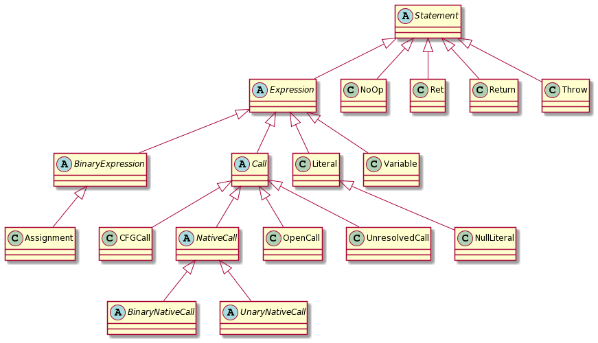
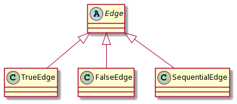
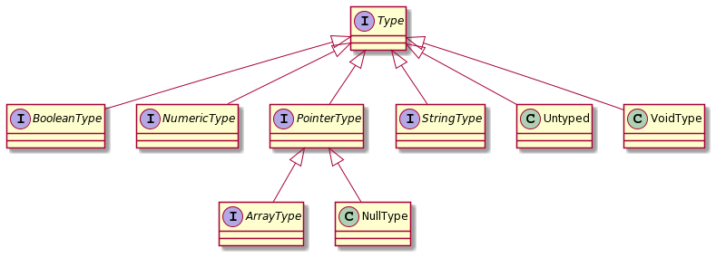

# The CFG structure

LiSA adopts a flexible CFG structure for representing functions, methods and procedures coming from all languages. A [CFG][cfg] is a graph with [Statements][st] as nodes and [Edges][edge] as edges. This enables to encode control flow structures directly on the structure of the CFG, keeping only statements that have a direct effect on the program state.

## Translating statements and expressions

Since LiSA aims at analyzing programs written in different programming languages, the Statement and Expression structure is designed to be as flexible as possible without enforcing language-specific patterns. Specifically, LiSA adopts a model that can be described as **(almost) everything is a procedure**, meaning that all the native constructs of a language are modeled through procedure calls, with few exceptions. The class hierarchy of statements is the following (that is all contained into the [statements][stpkg] package):



As can be seen from the above schema, few constructs that are common to most programming languages have been specifically implemented. These are the ones that have a consistent semantic across different languages, and thus can be represented in an uniform way.

While most of the instances are self explainatory, the [Call][call] class - that is, where the magic happens - deserves some attention. LiSA defines four types of calls:
* [UnresolvedCalls][unrescall] are effective calls towards other CFGs, that is yet to be resolved through its actual target(s);
* [CFGCalls][cfgcall] are effective calls towards one or more of the CFGs defined in the program to analyze;
* [OpenCalls][opencall] are effective calls towards a CFG that has not been submitted to LiSA, that therefore has no knowledge on;
* [NativeCalls][nativecall] are usages of native constructs (e.g., `+`, `<`, `array[index]`, ...) that are simulated through a call.

### About regular calls

Call target resolution may happen at compile (or link) time or at runtime. In the latter case, correctly identifying call targets while parsing the code is not possible, unless the frontend takes care of inferring the runtime types. After type inference, dynamic targets can be evaluated, and the appropriate `Call` instance can be produced (that is, an `OpenCall` if no target has been found in the codebase under analysis, or a `CFGCall` towards all runtime targets).  

However this is not mandatory: LiSA offers both builtin type inference and call target resolution. Thus, frontends can translate procedure calls with `UnresolvedCall`s, specifying only the call signature and its parameters. The `CallGraph` instance specified for the analysis (see "[The Analysis Infrastructure](analysis-infrastructure.md#the-callgraph-interface)" for more details) will resolve `UnresolvedCall`s to either an `OpenCall` or a `CFGCall` targeting all possible runtime targets, exploiting type information. Note that type inference is executed on-demand: this means that, by default, the runtime types of an expression correspond to its static type. To compute runtime types, call `lisa.setInferTypes(true)` before executing the analysis with `lisa.run()`.

For more information about LiSA's type system, see the [Typing](#typing) section.

### About native calls

Simulating native constructs without directly defining them enables different semantics for the same construct, depending on the language that they are written in (i.e., the frontend that translated the code). A simple but meaningful example is the handling of array access statements. The statement `array[index]` has different meaning under different languages. For instance, in languages like Java, executing such a statement will lead to a runtime error if index is less than 0. However, in a program written in Python, `index = -1` will cause the array access statement to access the last element of the array. Having a unique semantics for array access will require instrumentation code to be prefixed to the statement to ensure that the correct semantics is obtained. For instance, if the semantics was the one of the Java language, a Python frontend would need to generate (and then translate) the following code to comply with the language semantics:
```python
if index < 0:
    index = array.length - index
array[index]
```
While this may be feasible for some statements' semantics, it is certainly not ideal, and might not be attainable for all kind of statements. Moreover, this enforces the definition of the various statements within LiSA, providing also a fixed semantics that authors of frontends need to adapt to. Instead, the approach taken by LiSA is to let frontends themselves define the constructs, together with their semantics. For instance, a Java frontend will translate the array access statement as a subclass of `NativeCall`:
```java
class JavaArrayAccess extends NativeCall { ... }
```
and its `semantics` method will provide the actual statement's semantics (here reported as partial pseudocode):
```
if index is definitly negative
    return bottom
else 
    return domain.valueof(heapAbstraction.get(array, index))
```
A Python frontend will then define its own instance of `NativeCall`:
```java
class PythonArrayAccess extends NativeCall { ... }
```
together with its `semantics` method (reported as partial pseudocode):
```
if index is definetly negative
    return domain.valueof(heapAbstraction.get(array, domain.lengthof(array) - index))
else 
    return domain.valueof(heapAbstraction.get(array, index))
```
While this avoids instrumentation code and the definition of a standard set of constructs inside LiSA, it also provides an elegant way to support multi-language analysis with precise language-based semantics.

## Encoding control flow 

The [Edge][edge] class has three concrete instances:
* [SequentialEdge][seq] modeling a sequential flow between two statements, where the second one is executed right after the first;
* [TrueEdge][true] modeling a conditional flow between two statements, where the second one is executed only if the result of the first is a _true_ boolean value;
* [FalseEdge][false] modeling a conditional flow between two statments, where the second one is executed only if the result of the first is a _false_ boolean value;



Below you can find examples on how to model the most common control flow structures.

### Sequences of statements

Encoding sequential flow between two statements is achieved as follows.

Source code:
```java
void foo() {
  x = 5;
  print(x);
}
```
LiSA code:
```java
CFG foo = new CFG(new CFGDescriptor("foo"));
Assignment a = new Assignment(foo, new Variable(foo, "x"), new Literal(foo, 5));
// depending on where 'print' is defined, a different instance of call can be used
Call print = new OpenCall(foo, "print", new Variable(foo, "x"));
foo.addNode(a, true);
foo.addNode(print);
foo.addEdge(new SequentialEdge(a, print));
```

### If statments

Encoding if statements is achieved as follows.

Source code:
```java
void foo(x) {
  if (x > 5)
	print("yes");
  else
    print("no");
}
```
LiSA code:
```java
CFG foo = new CFG(new CFGDescriptor("foo", new Variable("x")));
// assuming that GreaterThan is a subclass of NativeCall defined somwhere else in the frontend
Call gt = new GreaterThan(foo, new Variable(foo, "x"), new Literal(foo, 5));
// depending on where 'print' is defined, a different instance of call can be used
Call print1 = new OpenCall(foo, "print", new Literal(foo, "yes"));
Call print2 = new OpenCall(foo, "print", new Literal(foo, "no"));
foo.addNode(gt, true);
foo.addNode(print1);
foo.addNode(print2);
foo.addEdge(new TrueEdge(gt, print1));
foo.addEdge(new FalseEdge(gt, print2));
```

### While loops

Encoding while loops is achieved as follows.

Source code:
```java
void foo(x) {
  while (x > 5)
    x = x - 1;
  print(x);
}
```
LiSA code:
```java
CFG foo = new CFG(new CFGDescriptor("foo", new Variable("x")));
// assuming that GreaterThan and Sub are subclasses of NativeCall defined somwhere else in the frontend
Call gt = new GreaterThan(foo, new Variable(foo, "x"), new Literal(foo, 5));
Assignment a = new Assignment(foo, new Variable(foo, "x"), new Sub(foo, new Variable(foo, "x"), new Literal(foo, 1)));
// depending on where 'print' is defined, a different instance of call can be used
Call print = new OpenCall(foo, "print", new Variable(foo, "x"));
foo.addNode(gt, true);
foo.addNode(a);
foo.addNode(print);
foo.addEdge(new TrueEdge(gt, a));
foo.addEdge(new SequentialEdge(a, gt));
foo.addEdge(new FalseEdge(gt, print));
```

### For loops

Encoding for loops is achieved as follows.

Source code:
```java
void foo() {
  for (x = 10; x > 5; x = x - 1)
    print(x);
  print("done");
}
```
LiSA code:
```java
CFG foo = new CFG(new CFGDescriptor("foo"));
// assuming that GreaterThan and Sub are subclasses of NativeCall defined somwhere else in the frontend
Assignment a1 = new Assignment(foo, new Variable(foo, "x"), new Literal(foo, 10));
Call gt = new GreaterThan(foo, new Variable(foo, "x"), new Literal(foo, 5));
Assignment a2 = new Assignment(foo, new Variable(foo, "x"), new Sub(foo, new Variable(foo, "x"), new Literal(foo, 1)));
// depending on where 'print' is defined, a different instance of call can be used
Call print1 = new OpenCall(foo, "print", new Variable(foo, "x"));
Call print2 = new OpenCall(foo, "print", new Literal(foo, "done"));
foo.addNode(a1, true);
foo.addNode(gt);
foo.addNode(print1);
foo.addNode(a2);
foo.addNode(print2);
foo.addEdge(new SequentialEdge(a1, gt));
foo.addEdge(new TrueEdge(gt, print1));
foo.addEdge(new SequentialEdge(print1, a2));
foo.addEdge(new SequentialEdge(a2, gt));
foo.addEdge(new FalseEdge(gt, print2));
```

### Do-While loops

Encoding do-while loops is achieved as follows.

Source code:
```java
void foo(x) {
  do
    x = x - 1;
  while (x > 5);
  print(x);
}
```
LiSA code:
```java
CFG foo = new CFG(new CFGDescriptor("foo", new Variable("x")));
// assuming that GreaterThan and Sub are subclasses of NativeCall defined somwhere else in the frontend
Assignment a = new Assignment(foo, new Variable(foo, "x"), new Sub(foo, new Variable(foo, "x"), new Literal(foo, 1)));
Call gt = new GreaterThan(foo, new Variable(foo, "x"), new Literal(foo, 5));
// depending on where 'print' is defined, a different instance of call can be used
Call print = new OpenCall(foo, "print", new Variable(foo, "x"));
foo.addNode(a, true);
foo.addNode(gt);
foo.addNode(print);
foo.addEdge(new SequentialEdge(a, gt));
foo.addEdge(new TrueEdge(gt, a));
foo.addEdge(new FalseEdge(gt, print));
```

### About NoOps

Depending on how the language parser embedded in the frontend is written, there might be the need of immediately creating an exit point of a statement. This might be a problem when translating conditional statements, since there might be multiple exit points (e.g., the last instructions of both the true and false branches of an if statement). This can be achieved with a [NoOp][noop] statement as follows (this extends the example used to introduce the embedding of if statements):

```java
CFG foo = new CFG(new CFGDescriptor("foo", new Variable("x")));
Call gt = new GreaterThan(foo, new Variable(foo, "x"), new Literal(foo, 5));
Call print1 = new OpenCall(foo, "print", new Literal(foo, "yes"));
Call print2 = new OpenCall(foo, "print", new Literal(foo, "no"));
NoOp noop = new NoOp(foo);
foo.addNode(gt);
foo.addNode(print1);
foo.addNode(print2);
foo.addNode(noop);
foo.addEdge(new TrueEdge(gt, print1));
foo.addEdge(new FalseEdge(gt, print2));
foo.addEdge(new SequentialEdge(print1, noop));
foo.addEdge(new SequentialEdge(print2, noop));
```
All NoOps that have been added can be automatically removed, causing a re-computation of the whole graph behind the CFG, with `foo.simplify()`. 

## Typing

Types in LiSA are modeled mostly through interfaces.



Having types as interfaces enable definitions of custom type hierarchies. For instance, in languages where everything is an object, variables of numeric types also represent memory locations. For this reason, types representing numeric entities (e.g., integers) should also be treated as pointers to heap locations. The interface structure allows types to be defined as follows:
```java
class IntegerType implements NumericType, PointerType { ... }
```
enabling custom type hierarchies that might be different from one language to another, *even within the same analysis*. 

Notice that, for analyses to work correctly, methods like `equals()`, `commonSupertype()` and `canBeAssignedTo()` should consider interface equality/subtyping instead of the actual class hierarchy. For instance, when analyzing a program written in two different languages (and thus translated to LiSA cfgs by two different frontends), such methods might be invoked passing as parameter a type instance from the other frontend:
```java
// inside java frontend
class JIntType implements NumericType { ... }

// inside c frontend
class CIntType implements NumericType { ... }

// inside one of LiSA's call graph implementations
if (t1.canBeAssignedTo(t2))
    // do stuff
```
The code inside one of the `CallGraph` implementations, as shown above, might evaluate the signature of a Java method exposed to C programs through JNI. To determine compatibility, actual parameters of the call will be checked against their formal definition for assignability. If `t1` is the type of the actual parameter coming from the C codebase (e.g., an instace of `CIntType`) and `t2` is the formal type coming from the Java signature (e.g., an instance of `JIntType`), the `canBeAssignedTo()` implementation of `CIntType` has to ignore properties of the concrete instance of its parameter (that is, no checks similar to `other instanceof CIntType`) and instead rely on its interface properties (e.g., `other instanceof NumericType && other.asNumeric().is32Bit()`).

LiSA provides three concrete implementations of the `Type` interface, that are meant to be unique across all languages (thus they do not need to be redefined in frontends):
* [NullType][nulltype] is the type of the `null` constant;
* [VoidType][voidtype] is the `void` type, primarely used as return type of methods that do not return a value;
* [Untyped][untyped] is a special type token used to model variables, parameters and methods return types that are not statically defined.

`Untyped` is the root of the type lattice, and is the default type for all typed constructs in LiSA. This enables the modeling of non statically typed languages without having to perform type inference at parse time.

[cfg]:https://github.com/lisa-analyzer/lisa/blob/master/lisa/lisa-sdk/src/main/java/it/unive/lisa/program/cfg/CFG.java
[st]:https://github.com/lisa-analyzer/lisa/blob/master/lisa/lisa-sdk/src/main/java/it/unive/lisa/program/cfg/statement/Statement.java
[edge]:https://github.com/lisa-analyzer/lisa/blob/master/lisa/lisa-sdk/src/main/java/it/unive/lisa/program/cfg/edge/Edge.java
[seq]:https://github.com/lisa-analyzer/lisa/blob/master/lisa/lisa-sdk/src/main/java/it/unive/lisa/program/cfg/edge/SequentialEdge.java 
[true]:https://github.com/lisa-analyzer/lisa/blob/master/lisa/lisa-sdk/src/main/java/it/unive/lisa/program/cfg/edge/TrueEdge.java 
[false]:https://github.com/lisa-analyzer/lisa/blob/master/lisa/lisa-sdk/src/main/java/it/unive/lisa/program/cfg/edge/FalseEdge.java 
[noop]:https://github.com/lisa-analyzer/lisa/blob/master/lisa/lisa-sdk/src/main/java/it/unive/lisa/program/cfg/statement/NoOp.java
[stpkg]:https://github.com/lisa-analyzer/lisa/blob/master/lisa/lisa-sdk/src/main/java/it/unive/lisa/program/cfg/statement/
[call]:https://github.com/lisa-analyzer/lisa/blob/master/lisa/lisa-sdk/src/main/java/it/unive/lisa/program/cfg/statement/call/Call.java
[cfgcall]:https://github.com/lisa-analyzer/lisa/blob/master/lisa/lisa-sdk/src/main/java/it/unive/lisa/program/cfg/statement/call/CFGCall.java
[opencall]:https://github.com/lisa-analyzer/lisa/blob/master/lisa/lisa-sdk/src/main/java/it/unive/lisa/program/cfg/statement/call/OpenCall.java
[nativecall]:https://github.com/lisa-analyzer/lisa/blob/master/lisa/lisa-sdk/src/main/java/it/unive/lisa/program/cfg/statement/call/NativeCall.java
[unrescall]:https://github.com/lisa-analyzer/lisa/blob/master/lisa/lisa-sdk/src/main/java/it/unive/lisa/program/cfg/statement/call/UnresolvedCall.java
[nulltype]:https://github.com/lisa-analyzer/lisa/blob/master/lisa/lisa-sdk/src/main/java/it/unive/lisa/type/NullType.java
[voidtype]:https://github.com/lisa-analyzer/lisa/blob/master/lisa/lisa-sdk/src/main/java/it/unive/lisa/type/VoidType.java
[untyped]:https://github.com/lisa-analyzer/lisa/blob/master/lisa/lisa-sdk/src/main/java/it/unive/lisa/type/Untyped.java