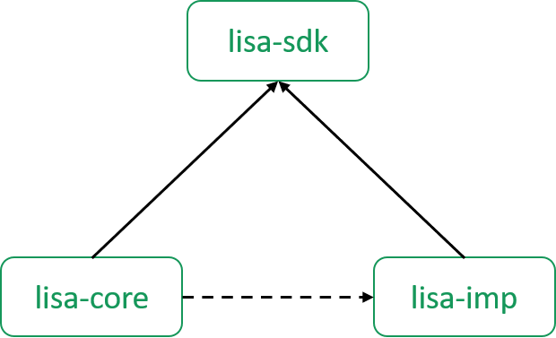

# Projects structure

LiSA is split into several sub-projects, organized as in the following image, where straight arrows are compile dependencies, while dashed ones are test dependencies.

In each project, source files are located under `src/main/java`, while test source files are located under `src/test/java`.
The root project `lisa` defines some common logic for the whole ecosystem, as coding style checks and test grouping. Specifically:
* code style - [spotless](https://github.com/diffplug/spotless) is used to enforce an eclipse-like coding style stored inside `spotless-formatting.xml`, while [checkstyle](https://checkstyle.sourceforge.io/) is used to check that the javadoc is present and fully provided on all non-private program members
* build - information from `git` is injected into the manifest of all generated jar files, in order to fully reconstruct the state when a jar file was built
* test - tests are automatically split into normal tests and cron tests depending on their package (tests under packages named `it.unive.lisa.cron.*` will be part of the latter). Cron tests are excluded from normal builds, are they represent possibly long-running tests that should not be executed every time
* coverage - [JaCoCo](https://www.jacoco.org/jacoco/) is imported as plugin to allow manual generation of coverage reports
* build targets - the following custom tasks have been added to the build:
    * `cron`: executes tests under all packages like `it.unive.lisa.cron.*`
	* `allTests`: executes both normal and cron tests
	* `checkCodeStyle`: runs both checkstyle and spotless to ensure coding style is respected
	* `completeBuild`: builds the project, runs normal and cron tests, and checks coding style

On each push to the `master` branch, a `completeBuild` is ran, wile pushes on other branch just perform a regular build. When a pull request is opened, and whenever new commits are pushed to that request, a `completeBuild` is ran and its successful result is a blocking criterion for the acceptance of the pull request.

### lisa-sdk

`lisa-sdk` is the main artifact of LiSA, and it contains all the classes needed for developing frontends and analysis components, but contains no execution logic nor analysis implementations. The main packages of this project are:
* package `it.unive.lisa.analysis` contains all interfaces and base classes for the definition and implementation of abstract domains
* package `it.unive.lisa.checks` contains the definition of syntactic and semantic checks
* package `it.unive.lisa.interprocedural` contains all interfaces and base classes for the definition and implementation of interprocedural analyses and call graphs
* package `it.unive.lisa.program` contains the program structure: from the program itself, to compilation units, cfgs, statements and expressions
* package `it.unive.lisa.symbolic` contains the definition of the symbolic expressions and their operators
* package `it.unive.lisa.type` contains the type hierarcy 

For more information on these concepts, read the documentation on [LiSA's foundations](index.md).

### lisa-core

`lisa-core` contains the implementations of abstract domains, call graphs and interprocedural analyses following the interfaces provided in `lisa-sdk`, as well as the execution logic. Specifically, [LiSA.java](https://github.com/lisa-analyzer/lisa/blob/master/lisa/lisa-core/src/main/java/it/unive/lisa/LiSA.java) is the entry point for running an analysis, that receives instances of [LiSAConfiguration.java](https://github.com/lisa-analyzer/lisa/blob/master/lisa/lisa-core/src/main/java/it/unive/lisa/LiSAConfiguration.java) for setting it up. [LiSAFactory.java](https://github.com/lisa-analyzer/lisa/blob/master/lisa/lisa-core/src/main/java/it/unive/lisa/LiSAFactory.java) can instead be used to instantiate various analysis components using default values, with the capability of customizing such defaults.

`lisa-core` also contains tests that run complete analyses, registered as cron tests, that verify the behavior of the implementations provided by the project itself. These tests work by comparing all files (except logs) generated by the analysis with baseline results under the folder `imp-testcases`. The tests usually run inside `test-outputs`, that is treated as a temporary folder whose contents are not committed and can be deleted at any point.

### lisa-imp

`lisa-imp` contains the IMP frontend that is used for demos and internal testing (mostly for cron tests in `lisa-core`). The project uses [antlr](https://www.antlr.org/) for generating a lexer and a parser starting from a grammar defined in `src/main/antlr`. Outputs of the generation are stored under `build/generated-src/antlr/main` and are used as additional sources for the project. The IMP frontend mostly uses expressions and types from the base ones present in `lisa-sdk`. For a documentation about the language, see the dedicated page [here]({{ site.baseurl }}/imp/).

## Releases 0.1b1 and older

LiSA was composed by one monolithic project that can be found [here](https://search.maven.org/search?q=a:lisa). The IMP frontend was all contained in the test source folder.